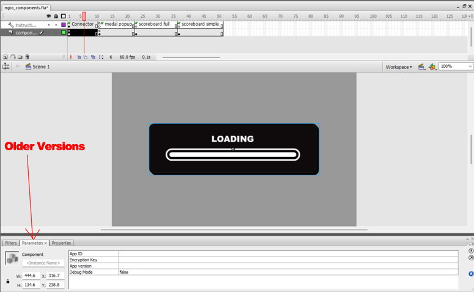
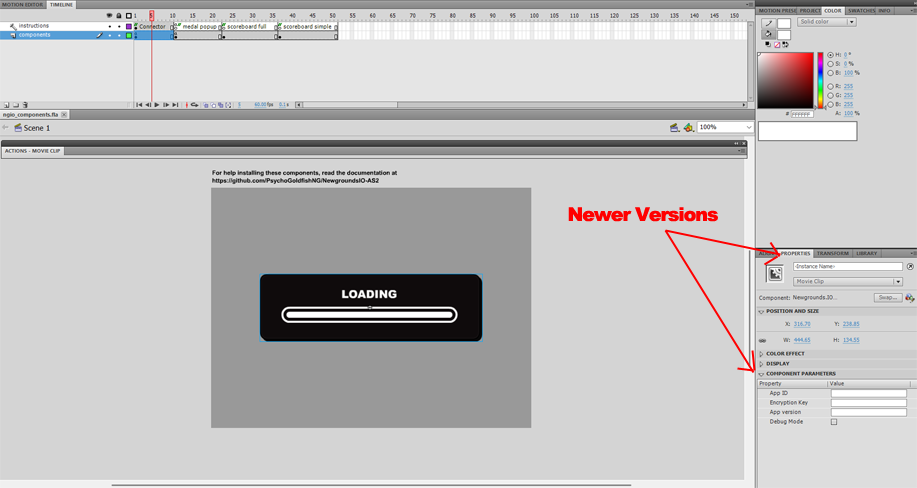

# NewgroundsIO-AS2

This is a library of ActionScript 2.0 classes for interactng with the [Newgrounds.IO API](https://www.newgrounds.io).

## Installation

**Step 1:** [Download the ActionScript library](/PsychoGoldfishNG/NewgroundsIO-AS2/blob/main/src/NGIO.zip)

**Step 2:** Extract library where Flash can access it.

If you only ever plan on using this once, you can unzip the contents to the same directory as your .fla file, and your project will import it that way.

If you want all of your Flash projects to have access to the library, you can either unzip it to the global class path, or save it wherever you like and add a new class path.

Global class paths can be found at:
* **Windows**: 
Hard Disk\Documents and Settings\user\Local Settings\Application Data\Adobe\Adobe Flash CS3\language\Configuration\Classes.
* **Mac**: 
Hard Disk/Users/user/Library/Application Support/Adobe/Adobe Flash CS3/language/Configuration/Classes

*(replace Adobe Flash CS3 with whatever version of Flash you have installed)*

To add a new class path, go into Edit->Preferences->ActionScript and press the AcrionScript 2.0 Settings button.  Hit the + button to add a new row, then the crosshair button to set the actual path.

## Using the Library

Before doing anything, you will need to [have a project created on Newgrounds](https://www.newgrounds.com/projects/games).

Once you have a project, look towards the bottom of the page for the **API Tools** button, and click it.

On this page you will see your App Credentials, and links to all the various features.

Once the library is installed, and your project is set up, you have a few options on how you can use it.  

The simplest way is to [download the component library](/PsychoGoldfishNG/NewgroundsIO-AS2/blob/main/src/ngio_components.fla) and use the pre-fabricated clips.

## NGIO Components

### The Newgrounds.IO Connector

This is the most important component as it is used to initialize your app and get a valid user session.

You can copy and paste this into the first frame of your movie if you want to use it as a preloader, or in the first frame after your custom preloader.

Once the component is on your stage, select it, and find the component parameters tab.

Copy the App ID and Encryption Key, from your project's API Tools page, into the matching parameter boxes.

If you set an 'Official Version Number' in your App Settings, copy this to the App version parameter as well.

You can check or set the debug option to true if you want to test in debug mode.  This will output all network communications, and will run your API commands without actually posting anything to user accounts (medals won't actually unlock, scores won't be recorded, etc).

Once this component is set up, you should be able to test things. 

When you run your movie, the component will check your app version and look for any game protection settings. If the user is playing an outdated version, or is on a host you haven't approved, the component will direct them to play your official version.

If these checks all pass, it will then look for a valid user session.  If the game is running directly on Newgrounds, and the user is logged in, it will act like everything has been loaded and move on.

If the user is not logged in, it will prompt them to do so and handle checking for updates to the current session while they do so.  When a user logs in this way, they can check the 'remember me' box, and your game will save their session ID.  The next time they start the game, they will see a welcome screen and be given the option to log out or continue.

Once you have a valid login, it will pull in all your app's metadata (medal lists, scoreboards, save slots, etc) and call the Event.logView component.

Finally, it will tell the main movie to play, where you can finally start the actual game.

At this point you should be able to use the other components and the NGIO class.

**Note:** You can edit everything in these components to match the vibe of your app if you know what you are doing.

### The Newgrounds.IO Medal Popup
This is the clip you'll want to use to unlock medals and show the fancy unlock animation.

The best way to use this clip is to copy it on the root timeline, above any frames where unlocking a medal is possible.

This clip will automatically attach itself to the NGIO class, so you can easily unlock medals using the following code:

    NGIO.medalPopup.unlock(medal_id);

*(When you create medals on your project, they will all have a unique ID number you can use in place of medal_id.)*

**Note:** If the user is not logged in, the above code will simply do nothing.

**Also Note:** This popup doesn't load your custom icons. 

Newgrounds has moved to using webp images, and Flash is simply too old to support them.  The icons on this component are, instead, based on the medal difficulty.

If you wanted to create a custom medal popup, you can do that and use the following code to unlock the medal in the background:

    var medal = NGIO.getMedal(medal_id);
    medal.unlock();

### The Newgrounds.IO Scoreboard

We actually have 3 versions of this component.  

The first one is the full scoreboard, which will let players select any of your scoreboards, and check all of the different social and time-based views.

The second one is designed for a single scoreboard (the user can't change boards), but still has the different social and time based views.

The third is the simplest view, designed for a single board and will only show the scores with no additional options.

All of these are set up the same way.  

Copy and paste them wherever you would like to show a scoreboard.  Select the board, then go to the component parameters tab *(see where this is above in **The Newgrounds.IO Connector** section).*

Set the ScoreBoard ID of the board you want to show, the time period you want to load, and what users to Show.  If you want to filter scores by a specific tag, you can set that as well.

If you are using the first 2 versions of this component, these will simply set the default view, but the player will be able to flip through all the different options.

Each of these components has an [X] button to close them.  You can either edit the clip directly and change what it does, or use the following code to handle when it gets clicked:

    NGIO.scoreBoardComponent.onClose = function() {
        // do something
    };
**Note** If the user is not logged in, they can still see all the views except 'My Best' and 'Friends', which will be hidden.  All other views will automatically use the 'Everybody' setting.

## The NGIO Class

Some things simply have to be done using scripting.  The NGIO class is a wrapper for the Newgrounds.io library that is intended to make things as easy as possible.

When you use the Newgrounds.IO Connector, it will automatically configure this class for you, so don't forget to add that before you try to use it!

When this class is properly configured, it will also automatically call the Gateway.ping component every 5 minutes to keep your user sessions alive.

### Checking User Logins
Not every user that plays your game will want to sign up for Newgrounds, so you might need to check for that before you do certain things that are based around having an account.

Here's an example of how you can do that:

    if (NGIO.hasUser()) {
        // we have a user, so we can do stuff!
        var user_name = NGIO.getUser().name;
        var userpage_url = NGIO.getUser().url;
        
        // do the stuff...
        
    } else {
        // we can NOT do stuff....
    }

### Using Cloud Saves

You can save simple data on the server with cloud saves.  Each app will have 3 slots they can save data to (or more if you are a [Newgrounds Supporter](https://www.newgrounds.com/supporter)).  

The slots themselves also contain useful information you can use in any custom load screens you may make.

To get a save slot:

    var slot = NGIO.getSaveSlot(slot_number);
  
Once you have a slot selected, you can check it's metadata to see how much data is saved, when it was last updated etc.

    // has this slot even been used yet?
    var has_data = slot.hasData();
    
    // total data saved in bytes
    var filesize = slot.size;
    
    // last updated in an ISO 8601 format
    var last_updated = slot.datetime;
    
    // lasy updated in a UNIX timestamp format
    var last_timestamp = slot.timestamp;

You have 2 options for saving data.  You can either save a native ActionScript object, or you can save a raw string value.

    // to save a native object, array, etc...
    var data_to_save = {
	    level: 99,
	    name: "Bob",
	    inventory: {
	        health_potions: 3,
	        mana_potions: 1
	    },
	    party: [
		    "Dave",
		    "Emma",
		    "Steve"
	    ]
    };
    
    slot.setData(data_to_save);

    // to save a raw string
    var string_to_save = "lvl:99,name:Bob,potions:3,etc";
    
    slot.setDataRaw(string_to_save);

And you can load data back into a native object, or as a raw string as well:

    // load data into a native object
    slot.load(
        function(loaded_object) {
	        trace("Name: "+loaded_object.name);
	        trace("Level: "+loaded_object.level);
	        // etc...
	    },
	    this
	);
	
	// load data as a raw string
    slot.loadRaw(
        function(loaded_string) {
	        trace(loaded_string);
	    },
	    this
	);

**Notes:**

In both cases, we use a function to handle the loaded value.  This is because we have to wait for the data to be pulled from the server, and this will not happen instantly.  This is known as an asynchronous callback.

You will also notice, after the function, we have the word 'this'.  In ActionScript, when a function is called directly, it uses the context of whatever object, movieclip, class, etc it was called in as 'this'.  However, if a function is executed using function.call, you can pass an argument telling it what object to use as the 'this' context within the function.

If you used the code as I have it written on a MovieClip keyframe, you could use `this.play();` inside of the function, 'this' would refer to the MovieClip which would then play as expected.

Finally, if you want to delete a save slot, use the following:

    slot.clear();

### Checking a Medal's Status

You can check the status of any loaded medal like so:

    // get the medal object
    var medal = NGIO.getMedal(medal_id);
    
    // is it unlocked?
    var is_unlocked = medal.unlocked;
	
	// is this a secret medal?
	var is_secret = medal.secret;
	 
	// what other info can we glean?
	medal.id;
	medal.name;
	medal.description;
	medal.value;
	medal.difficulty;

And, if you are doing custom medal handling, you can even do this!

    medal.unlock(
        function(medal, medal_score) {
            trace("You just unlocked "+medal.name);
            trace("Your new medal score is "+medal_score);
        },
        this
    );

### Posting High Scores

Posting a high score is as simple as this:

    var scoreBoard = NGIO.getScoreBoard(board_id);
    scoreBoard.postScore(score_value, tag);

If you are using incremental scores, you might need to load the updated value using a callback:

    scoreBoard.postScore(
        score_value,
        tag,
        function(new_score) {
	        trace("The new value is "+score.value);
	        trace("But if you want to display it pretty, it's "+score.formatted_value);
        }
    );

**Note:** If you aren't using tags, you can just put null as the value.

If you want to load scores outside of the Newgrounds.IO ScoreBoard components, you can do that like so:

    // first you need to set up your filter object
    
    // If you want to get a general list of the best users....
    var filters = {
	    period: 'D', // this can be D,W,M,Y or A
	    social: false, // set to true if you only want to load the user's friends
	    tag: null // or set an actual string value if you use this
	};

	// or, if you want to look up the user's best scores:
	var filters = {
	    user: NGIO.getUser()
	};
	
	// now we can load the results
	scoreBoard.getScores(
	    function(scores) {
	        if (scores && scores.length > 1) {
	            for(var i=0; i<scores.length; i++) {
		            trace((i+1)+": "+scores[i].user.name+" => "+scores[i].formatted_value);
		             
		            // actual value can be pulled with:
		            scores[i].value;
	            }
	        } else {
	            trace('there are no scores right now');
	        }
	    },
	    this
	);

### Logging Events and Referrals

If you are using any custom events, or want to track how much traffic your app is referring to various URLs, you can use the following methods:

    // Log a custom event
    NGIO.logEvent(event_name);
    
    // Note: the following calls will open a new browser tab!
    
    // track a referral to Newgrounds (we appreciate you)
    NGIO.loadNewgrounds();
     
    // track a referral to the Newgrounds Games page (<3)
    NGIO.loadMoreGames();
     
    // track a referral to your author URL
    NGIO.loadAuthorURL();
     
    // track a referral to the official URL of your app
    NGIO.loadOfficialURL();
     
    // track a custom referral
    NGIO.loadReferral(referral_name);

## Advanced Use
While the components and NGIO class are all most people will ever need, advanced users can do anything the API is capable of doing.

One case that comes to mind is looking up medals from another game to grant bonus content in say, a sequel.

This can be done by using the NGIO core class and manually setting up components and handling result objects.

If you were to look at the [API documents for the Medal.getList component](https://www.newgrounds.io/help/components/#medal-getlist), you will see it can use an optional app_id property.

Because the NGIO class only preloads data for it's primary App ID, the helper methods there will only ever access those medals.

So, in order to use this extra property, we're going to set up a component object manually, and have our core class execute it.

The good news is we can get the core instance the NGIO class is already using, so we won't need to initialize anything else.

Here's how we would load the medals for another app:

    // create the Medal.getList component
    var component = new io.newgrounds.models.components.Medal.getList({
        app_id: app_id_for_other_game
    });
     
    // execue the component
    NGIO.core.executeComponent(
        component,
        
        // result will be an io.newgrounds.models.results.Medal.getList object
        function(result) {
         
            // now we can loop through the medals for this other game!
            for(i=0; i<result.medals.length; i++) {
                trace(result.medals[i].name);
            }
        },
        this
    );

**Notes:** 

You can also use the ScoreBoard.getScores, CloudSave.loadSlot, and CloudSave.loadSlots components with an external App ID.

When using an external App ID, the owner of that project must first give your game's App ID access via their App Settings page.

You can use the core object to execute any component (see the [Newgrounds.IO component documentation](https://www.newgrounds.io/help/components)), and the result object will always match the expected results for that specific component.

If you want to execute multiple components in a single call, you can use the component queue like so:

    var component;
     
    // let's say we want to see what the current time is on the newgrounds.io server...
    component = new io.newgrounds.models.components.Gateway.getDatetime();
    NGIO.core.queueComponent(component);
     
    // and we also want to know what version of the gateway we're calling
    component = new io.newgrounds.models.components.Gateway.getVersion();
    NGIO.core.queueComponent(component);
     
    // Now we can execute both of these components at the same time!
    NGIO.core.executeQueue(
         
        // results will be an array of result objects
        function(results) {
             
            // now we can loop through the results
            for(var i=0; i<results.length; i++) {
                
                switch(results[i].getObjectName()) {
                 
                    case "Gateway.getVersion":
                        trace("Gateway version: "+results[i].version);
                        break;
                       
                    case "Gateway.getDatetime":
                        trace("Server time: "+results[i].datetime);
                }
            }
        },
        this
    );
    
